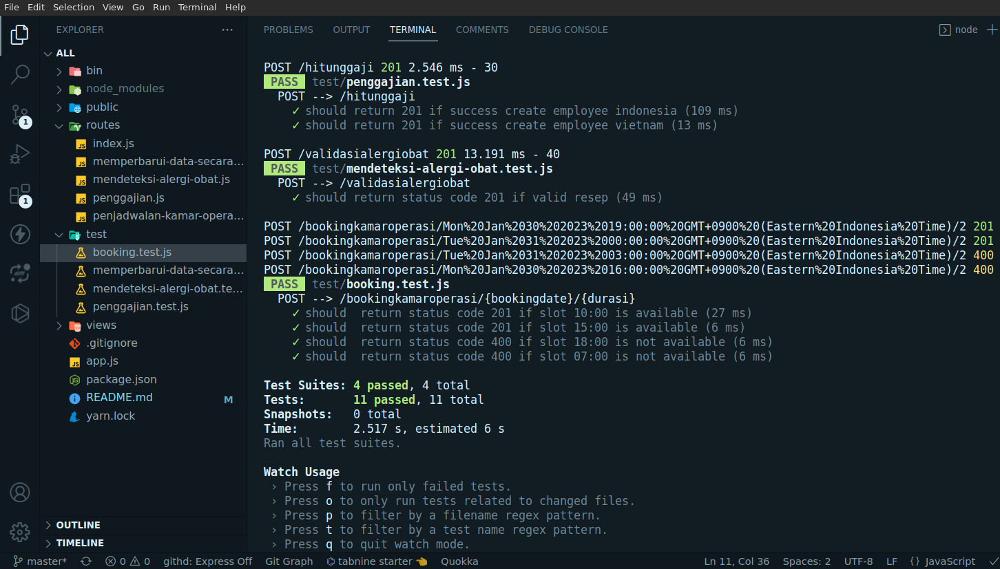

<a name="readme-top"></a>

[](https://github.com/franskbarek/nodejs-several-functionality/stars) [](https://github.com/franskbarek/nodejs-several-functionality/issues)

# Dokumentasi Teknis

## Tentang Aplikasi

Merupakan Web API sederhana dari beberapa fungsi logika, menggunakan teknologi Express.js.



<!-- TABLE OF CONTENTS -->
<details>
  <summary>Tabel konten</summary>
  <ol>
    <li>
      <a href="#tentang-aplikasi">Tentang Aplikasi</a>
      <ul>
        <li><a href="#teknologi-yang-digunakan">Teknologi yang digunakan</a></li>
      </ul>
    </li>
    <li>
      <a href="#installasi">Installasi</a>
    </li>
    <li>
      <a href="#aplikasi">Aplikasi</a>
      <ul>
        <li><a href="#penjadwalan-kamar-operasi">Penjadwalan Kamar Operasi</a></li>
        <li><a href="#penggajian">Penggajian</a></li>
        <li><a href="#mendeteksi-alergi-obat">Mendeteksi Alergi Obat</a></li>
        <li><a href="#memperbarui-data-secara-otomatis-dan-terjadwal">Memperbarui Data Secara Otomatis dan Terjadwal</a></li>
      </ul>
    </li>
  </ol>
</details>

---

## Teknologi yang digunakan

- yarn
- node.js
- express.js
- jest
- supertest
- postman

<p align="right">(<a href="#readme-top">back to top</a>)</p>

---

## Installasi

Install node modules yang terdapat pada **`package.json`** sebelum menjalankan aplikasi

Clone repositori ini ke komputer Anda git clone **`https://github.com/franskbarek/nodejs-several-functionality.git`**

Masuk ke dalam direktori aplikasi **`cd nodejs-several-functionality`**

Install dependensi **`npm install`** atau **`yarn`** jika menggunakan yarn

Jalankan aplikasi **`npm run start`** atau **`yarn start`** jika menggunakan yarn

Aplikasi akan berjalan pada http://localhost:8080 dan siap digunakan

<p align="right">(<a href="#readme-top">back to top</a>)</p>

---

## Aplikasi

## Penjadwalan Kamar Operasi

Untuk melakukan penjadwalan kamar operasi, aturannya adalah jarak antara satu operasi dengan operasi yang lain minimal 2 jam. Jika
seorang dokter ingin booking kamar operasi, harus menyampaikan tanggal dan jam kapan mau menggunakan kamar
operasi, dan estimasi durasi operasi tersebut. Response dari API ada dalam body, berisi hanya 2 kemungkinan saja, true atau false.

### Penggunaan

Untuk mulai mengoperasikan aplikasi dapat menggunakan API testing tool misal Postman, Insomnia dan lain-lain.

Untuk melakukan booking kamar operasi, gunakan permintaan POST ke alamat `http://localhost:8080/bookingkamaroperasi/{bookingdate}/{durasi}`

Contoh:

POST `http://localhost:8080/bookingkamaroperasi/2023-01-30T10:00:00.00Z/2`

Response ketika berhasil:

`true`

Response ketika gagal:

`false`

Untuk melihat seluruh jadwal operasi, gunakan permintaan GET ke alamat `http://localhost:8080/bookingkamaroperasi`

Contoh:

GET http://localhost:8080/bookingkamaroperasi

Response body ketika berhasil:

```
[
    {
        "startTime": "2023-01-15T10:00:00.000Z",
        "endTime": "2023-01-15T12:00:00.000Z",
        "duration": 2
    }
]
```

### Unit Testing

Untuk menjalankan unit testing pada aplikasi penjadwalan kamar operasi jalankan perintah **`yarn test-booking`** pada terminal dan posisi direktori root

<p align="right">(<a href="#readme-top">back to top</a>)</p>

---

## Penggajian

Untuk melakukan perhitungan gaji karyawan di berbagai negara, maka besar kemungkinan tiap-tiap negara memiliki regulasi penggajian yang berbeda beda. Katakanlah kita akan melakukan pembayaran gaji untuk karyawan di Indonesia dan di Vietnam.
Gaji karyawan di Indonesia dalam Rupiah (IDR) dan karyawan di Vietnam dalam Dong (VND). Tujuan pada aplikasi ini adalah menghitung gaji netto dan bruto perbulan, pertahun serta pajak perbulan dan pertahun dengan ketentuan pajak tiap-tiap negara dan status pernikahan. Dalam response body akan fokus mengembalikan pajak perbulan saja.

### Penggunaan

Untuk mulai mengoperasikan aplikasi dapat menggunakan API testing tool misal Postman, Insomnia dan lain-lain.

Untuk melakukan perhitungan penggajian, gunakan permintaan POST ke alamat `http://localhost:8080/hitunggaji`

Contoh:

POST http://localhost:8080/hitunggaji

Request body:

```
{
  "employee": {
    "name": "John",
    "id": "123",
    "nationality": "Indonesia",
    "marital_status": "K1"
  },
  "komponengaji": [
    {
      "name": "Basic Salary",
      "amount": 25000000
    },
    {
      "name": "Allowance",
      "amount": 5000000
    }
  ]
}
```

Response body ketika berhasil:

```
{
    "pajak_bulanini": "3.146.000"
}
```

### Unit Testing

Untuk menjalankan unit testing pada aplikasi penjadwalan kamar operasi jalankan perintah **`yarn test-penggajian`** pada terminal dan posisi direktori root

<p align="right">(<a href="#readme-top">back to top</a>)</p>

---

## Mendeteksi Alergi Obat

Tujuan aplikasi ini adalah dapat mengevaluasi potensi alergi obat pada seorang pasien atas sebuah resep.
Katakanlah pasien anak atas nama Bejo, mengidap alergi ibuprofen. Setelah konsultasi rawat jalan
dokter memberi resep berupa: Proris sirup 60ml dan Paratusin sirup 60ml. Maka ketika validasi obat dipanggil, dia akan me-return collection obat dengan panjang 1, berisi Proris. Hal ini dikarenakan Proris mengandung ibuprofen dimana Bejo alergi terhadapnya.

### Penggunaan

Untuk mulai mengoperasikan aplikasi dapat menggunakan API testing tool misal Postman, Insomnia dan lain-lain.

Untuk melakukan validasi alergi seorang pasien terhadap resep, gunakan permintaan POST ke alamat `http://localhost:8080/validasialergiobat`

Contoh:

POST http://localhost:8080/validasialergiobat

Request body:

```
{
  "pasien": {
    "nama": "Bejo",
    "alergi": [
      "ibuprofen"
    ]
  },
  "resep": [
    {
      "obat": "Proris Sirup 60ml",
      "kandungan": [
        "ibuprofen"
      ]
    },
    {
      "obat": "Paratusin Sirup 60ml",
      "kandungan": [
        "paracetamol 125mg",
        "pseudoepedrid 7.5mg",
        "noscapine 10mg",
        "ctm 0.5 mg",
        "guafenisin 25mg",
        "succus liquiritae 125 ethanol 10%"
      ]
    }
  ]
}
```

Response body ketika berhasil:

```
{
    "resep": [
        {
            "obat": "Proris Sirup 60ml"
        }
    ]
}
```

### Unit Testing

Untuk menjalankan unit testing pada aplikasi deteksi alergi obat jalankan perintah **`yarn test-validasiresep`** pada terminal dan posisi direktori root

<p align="right">(<a href="#readme-top">back to top</a>)</p>

---

## Memperbarui Data Secara Otomatis dan Terjadwal

Dalam dunia medis, umur merupakan data yang penting. Tidak seperti orang awam yang menyebut umur dalam magnitude tahun, dalam
dunia medis, umur sangat detail yakni terdiri dari Tahun Bulan dan Hari.
Misalnya seorang pasien yang lahir tanggal 28 Oktober 1983, maka pada tanggal 3 Oktober 2022 umurnya 38 tahun 11 bulan dan 6 hari. Tujuan aplikasi ini adalah menghitung detail umur pada data pasien.

### Penggunaan

Untuk mulai mengopersikan aplikasi dapat menggunakan API testing tool misal Postman, Insomnia dan lain-lain.

Untuk melakukan perhitungan umur pasien, gunakan permintaan GET ke alamat `http://localhost:8080/calculateage`

Contoh:

GET http://localhost:8080/calculateage

Request body:

```
{
    "currentDate": "2022-10-03"
}
```

Response body ketika berhasil:

```
38/11/6
```

### Unit Testing

Untuk menjalankan unit testing pada aplikasi perhitungan umur pasien jalankan perintah **`yarn test-calculateage`** pada terminal dan posisi direktori root

<p align="right">(<a href="#readme-top">back to top</a>)</p>

---
